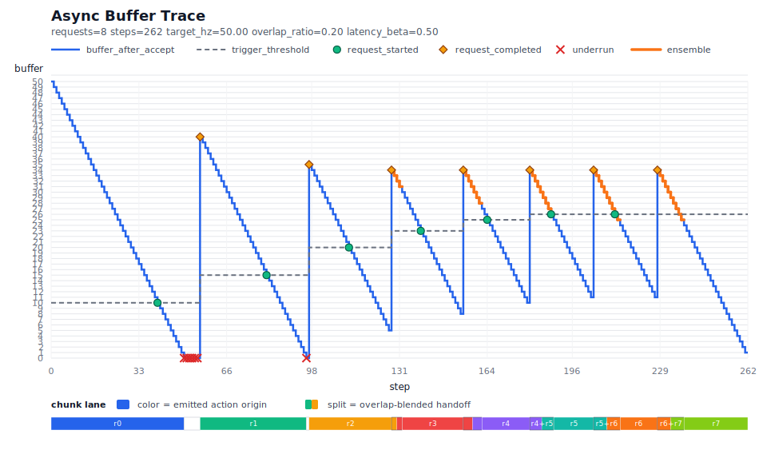

[](./README_CN.md)  
[](./README.md)

# inferaxis



`inferaxis` is a unified-data-interface, dynamically latency-adaptive inference
system for embodied control. It standardizes observations into `Frame`,
actions into `Action`, and keeps the outer execution loop stable through
`run_step(...)` and `InferenceRuntime(...)`.

The point of the project is simple: once your data matches the shared runtime
interface, the same loop can drive:

- normal sync inference
- async chunked inference
- dynamically latency-adaptive chunk scheduling
- local data collection
- replay of recorded actions
- sync-latency profiling and runtime recommendation

`inferaxis` is not a robot middleware, transport stack, or deployment system.
It focuses on the inference-side data contract and control loop.

## Install

```bash
git clone https://github.com/zywang03/inferaxis.git
cd inferaxis
pip install .
```

`inferaxis` is numpy-based inside the core runtime. Images, state, and action
payloads are normalized to `numpy.ndarray`.

## Core API

The public surface is intentionally small:

- `Frame`
- `Action`
- `Command`
- `run_step(...)`
- `InferenceRuntime(...)`
- `RealtimeController`

The runtime call boundary is:

- `observe_fn() -> Frame`
- `act_fn(action) -> Action | None`
- `act_src_fn(frame, request) -> Action | list[Action]`

Returning one `Action` means chunk size `1`. Returning `list[Action]` lets the
same source participate in overlap-aware async scheduling.

## Quickstart

```python
import inferaxis as infra
import numpy as np


class YourExecutor:
    def get_obs(self):
        return infra.Frame(
            images={"front_rgb": np.zeros((2, 2, 3), dtype=np.uint8)},
            state={
                "left_arm": np.zeros(6, dtype=np.float64),
                "left_gripper": np.array([0.5], dtype=np.float64),
                "right_arm": np.zeros(6, dtype=np.float64),
                "right_gripper": np.array([0.5], dtype=np.float64),
            },
        )

    def send_action(self, action):
        return action


class YourPolicy:
    def infer(self, frame, request):
        del frame, request
        return infra.Action(
            commands={
                "left_arm": infra.Command(
                    command=infra.BuiltinCommandKind.CARTESIAN_POSE_DELTA,
                    value=np.zeros(6, dtype=np.float64),
                ),
                "left_gripper": infra.Command(
                    command=infra.BuiltinCommandKind.GRIPPER_POSITION,
                    value=np.array([0.5], dtype=np.float64),
                ),
                "right_arm": infra.Command(
                    command=infra.BuiltinCommandKind.CARTESIAN_POSE_DELTA,
                    value=np.zeros(6, dtype=np.float64),
                ),
                "right_gripper": infra.Command(
                    command=infra.BuiltinCommandKind.GRIPPER_POSITION,
                    value=np.array([0.5], dtype=np.float64),
                ),
            }
        )


executor = YourExecutor()
policy = YourPolicy()

result = infra.run_step(
    observe_fn=executor.get_obs,
    act_fn=executor.send_action,
    act_src_fn=policy.infer,
)
```

If you only want normalized `frame -> action` inference:

```python
result = infra.run_step(
    frame=my_frame,
    act_src_fn=policy.infer,
    execute_action=False,
)
```

## Data Interface

`Frame` is the normalized observation container:

```python
frame = infra.Frame(
    images={"front_rgb": np.ndarray(...)},
    state={
        "left_arm": np.ndarray(...),
        "left_gripper": np.ndarray(...),
        "right_arm": np.ndarray(...),
        "right_gripper": np.ndarray(...),
    },
)
```

`Action` is the normalized control container:

```python
action = infra.Action(
    commands={
        "left_arm": infra.Command(
            command=infra.BuiltinCommandKind.CARTESIAN_POSE_DELTA,
            value=np.ndarray(...),
        ),
        "left_gripper": infra.Command(
            command=infra.BuiltinCommandKind.GRIPPER_POSITION,
            value=np.ndarray(...),
        ),
    },
)
```

Key runtime rules:

- `observe_fn()` must return `inferaxis.Frame`.
- `act_src_fn(frame, request)` must return `inferaxis.Action` or `list[inferaxis.Action]`.
- `act_fn(action)` receives `inferaxis.Action`.
- `timestamp_ns` and `sequence_id` are generated by inferaxis internally.

`command` is not a free string. It must match the declared command kind for that
component. Built-ins include:

- `joint_position`
- `joint_position_delta`
- `joint_velocity`
- `cartesian_pose`
- `cartesian_pose_delta`
- `cartesian_twist`
- `gripper_position`
- `gripper_position_delta`
- `gripper_velocity`
- `gripper_open_close`
- `hand_joint_position`
- `hand_joint_position_delta`
- `eef_activation`

Project-specific command kinds can be registered as `custom:...`.

## Runtime Features

`run_step(...)` is the single outer loop entrypoint. `InferenceRuntime(...)`
adds optimization and scheduling without changing that outer call style.

```python
runtime = infra.InferenceRuntime(
    mode=infra.InferenceMode.ASYNC,
    overlap_ratio=0.5,
    warmup_requests=1,
    profile_delay_requests=3,
    realtime_controller=infra.RealtimeController(hz=50.0),
)

result = infra.run_step(
    observe_fn=executor.get_obs,
    act_fn=executor.send_action,
    act_src_fn=policy.infer,
    runtime=runtime,
)
```

This lets the same data interface support:

- sync and async chunk execution
- async overlap-based chunk scheduling
- chunk handoff blending via `ensemble_weight=...`
- paced closed-loop execution
- latency profiling against a required target control hz via `profile_sync_inference(...)`
- mode recommendation via `recommend_inference_mode(...)`

When `mode=ASYNC`, no manual latency seed is needed anymore. If you attach a
`RealtimeController(...)`, inferaxis first issues request-only warmup calls for
`warmup_requests`, then profiles delay across `profile_delay_requests`
requests, converts that to control-step latency, and only then starts sending
actions to the robot. This bootstrap happens automatically on the first
`run_step(...)` call once `observe_fn` and `act_src_fn` are available.
Because of that startup warmup, `policy.infer(...)` should derive chunks from
`frame` and `request` instead of relying on mutable call-count state.
If you want startup warmup/profile to happen outside the first `run_step(...)`
call, use `runtime.bootstrap_async(...)` once before entering the loop.

When `enable_rtc=True`, `policy.infer(...)` receives the RTC hints directly on
`request.prev_action_chunk`, `request.inference_delay`, and
`request.execute_horizon`. The same values are also mirrored on
`request.rtc_args` for grouped access:

- `prev_action_chunk`: the full currently active chunk snapshot, kept at the active chunk length instead of shrinking with the live buffer
- `inference_delay`: the estimated number of control steps from request launch until the new chunk can begin taking effect, computed as `max(estimated_delay_steps, 1)`
- `execute_horizon`: the number of control steps from request launch until the current chunk finishes, so the effective RTC interval is `[inference_delay, execute_horizon)`

During cold start, the very first RTC bootstrap request is sent without RTC
args so inferaxis can seed one full previous chunk. Later warmup/profile
requests already send `prev_action_chunk`, letting the server warm up that
path before the first executable chunk is accepted. If that last RTC warmup
request takes more than `500ms`, inferaxis warns and asks whether startup
should continue. This still avoids needing `robot.get_spec()` or any extra
bootstrap length config.

For chunked async execution, inferaxis uses:

- `overlap_steps = floor(overlap_ratio * chunk_size)`
- `trigger_steps = ceil(H_hat) + overlap_steps`

Here `H_hat` starts from the startup delay profiled over
`profile_delay_requests` requests and is then updated online as an EMA of
observed request latency measured directly in control steps. When a reply
arrives, inferaxis drops the stale prefix and either
switches to the aligned new chunk directly or blends the overlap prefix when
`ensemble_weight=...` is set. `ensemble_weight` may be one scalar shared by
every overlap step or a `(low, high)` pair that ramps from the
earliest overlap step to the latest. Built-in gripper commands switch to the
new chunk directly instead of being averaged. It does not apply an extra
per-step temporal filter to every emitted action. In practice, this makes
inferaxis a dynamically latency-adaptive inference system: request timing is
updated online from measured chunk latency instead of being fixed ahead of time.
`ensemble_weight` defaults to `None`. If it is omitted, inferaxis does not
blend overlap actions and
simply switches to the aligned new chunk.

## Validation

`check_policy(...)` and `check_pair(...)` are dry-run validation helpers.

- They validate the interface contract.
- They issue at most one observation request and one policy inference call.
- They do not call `act_fn(...)`.

## Examples

The public examples are fixed to these six paths:

1. [`examples/01_sync_inference.py`](./examples/01_sync_inference.py)
2. [`examples/02_async_inference.py`](./examples/02_async_inference.py)
3. [`examples/03_data_collection.py`](./examples/03_data_collection.py)
4. [`examples/04_replay_collected_data.py`](./examples/04_replay_collected_data.py)
5. [`examples/05_profile_inference_latency.py`](./examples/05_profile_inference_latency.py)
6. [`examples/06_async_inference_with_rtc.py`](./examples/06_async_inference_with_rtc.py)

Together they show the intended scope of the system: one shared data interface,
one outer loop, multiple inference-time use cases.

More detail lives in [`docs/plain_objects_guide.md`](./docs/plain_objects_guide.md)
and [`docs/examples_guide.md`](./docs/examples_guide.md).
